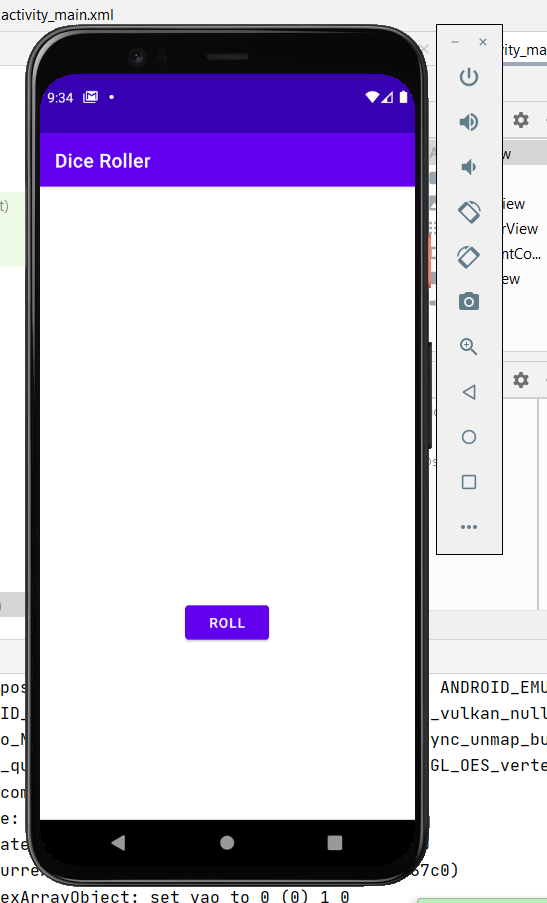
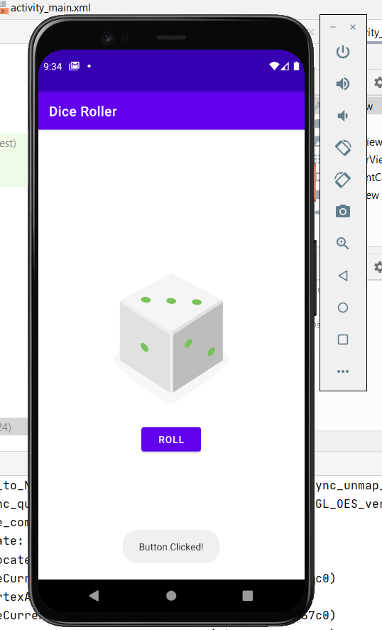
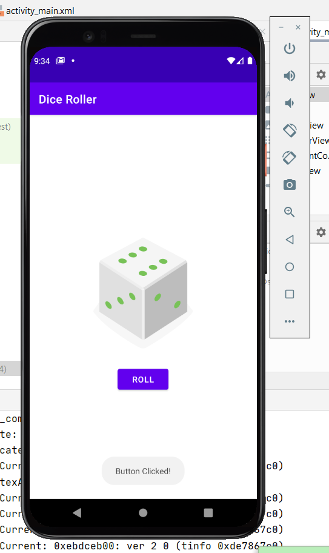
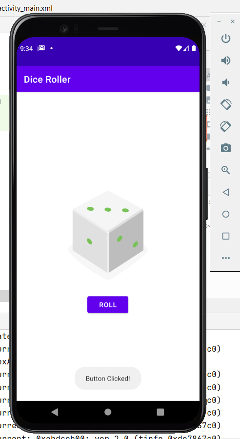

# DiceRoller

When we think of a die, a small cubic object comes to mind which, when dropped on a flat surface, shows one of its possible faces. A traditional die has six faces, and on each of its faces, numbers from 1 to 6. Rolling the die implies that chance will show a whole number from one to six, and that the odds of each of those numbers coming up are the same, due to the geometric shape, as long as the die is perfect.  However, perfection is difficult to obtain, and wear and tear is often noticeable on the dice. That is one of the many reasons why at Roll the Dice we provide you with the infallible and totally random virtual dice.  With our virtual dice you can be the one who takes full control of the dice, either to choose the most suitable dice for each occasion and game, or to create the personalized dice that allows you to make the roll adapted to your needs.
 
 

 
Udacity temple app for first lessons 
- Use Kotlin construction lateinit 
- Use simple animations 
